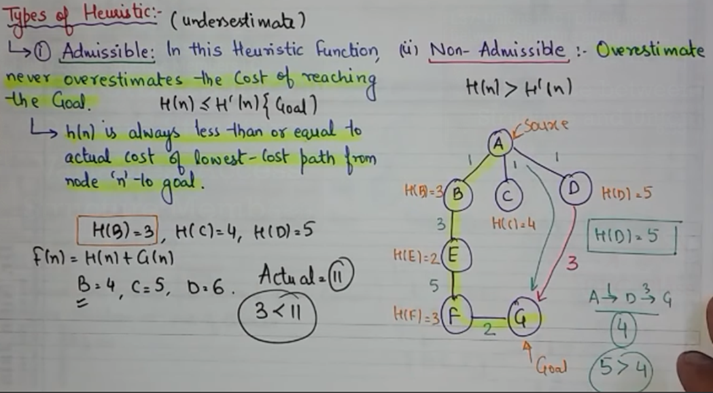

# HEURISTIC / INFORMED SEARCH
Helps to find the most efficient path from a starting state to a goal state  
Tries to solve a problem in minimum steps / cost using heuristic function.    

## Heuristic Function ?
H(n) that gives an estimation on cost of getting from node 'n' to the GOAL state.  
Helps in selecting optimal node for expansion.

---

## 8 Puzzle Problem
