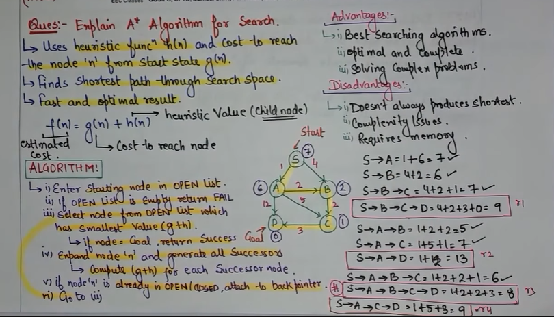

# A* Algorithm

---
Powerful graph traversal and pathfinding algorithm  
Finds shortest path b/w 2 nodes.  
Combines the advantages of -  
    Dijkstra's algorithm and Greedy Best-First Search.

Uses heuristic function and actual cost to reach node 'n' form start node.

    F(n) = h(n) + g(n)

---
**ADVANTAGES**  
Optimal Solution, Completeness, Efficiency, Solves complex problems

**DISADVANTAGES**   
Not Always shortest, Complexity, Require large memory

---

    1. Initialize Open and Closed List
    2. Add Start node to open list
       1. Compute g(n) + h(n)
    3. Repeat until List is empty or goal reached
       1. Select node with lowest F(n)
       2. Move Selected node to closed list
       3. Expand and generate all sucessors
       4. Compute F(n) for each sucessor
       5. If a successor is already in the Open list with a lower g(n) value,  
       discard the new path.
       6. If a successor is in the Closed list and the new path is better,  
       move it back to the Open list.