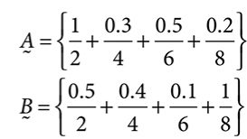
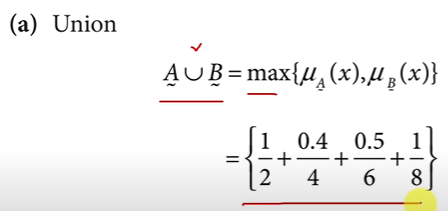

# FUZZY LOGIC

Father : Lotfi Zadeh

Classical logic → binary: True (1) or False (0)  
Fuzzy logic deals with degrees of truth between 0 and 1.

Useful in systems where vagueness, ambiguity, or uncertainty exist

## FUZZY SET
A fuzzy set A in universe X assigns each element x in X a membership value µA(x) ∈ [0, 1].  

## Operations

## QUESTIONS

## Types of Membership Functions
Membership functions define how input maps to fuzzy degree. Common types:
- Triangular
- Trapezoidal
- Gaussian
- Sigmoidal
- Bell-shaped

## Linguistic Variables and Hedges
Linguistic Variable: variable whose values are words (e.g., temperature = {cold, warm, hot})
- Hedges: modifiers like "very", "somewhat", "more or less"
- Example: "very hot" → squaring µ(x)

##  Fuzzy Propositions
Statements involving fuzzy logic:
Example:
“If temperature is hot then fan speed is high”
→ Both "hot" and "high" are fuzzy sets.

## Fuzzy Systems
A fuzzy system is a system that uses fuzzy logic for decision making.
Components:
1. Fuzzification: Convert crisp input → fuzzy sets
2. Rule Base: Collection of IF-THEN rules
3. Inference Engine: Apply rules to fuzzy inputs
4. Defuzzification: Convert fuzzy output → crisp output