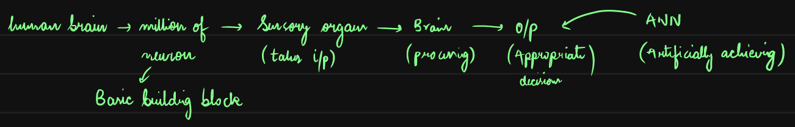
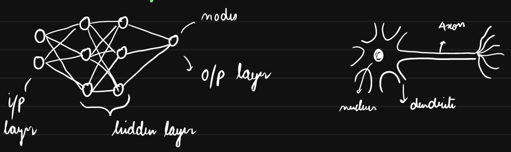
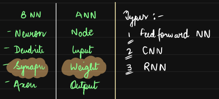
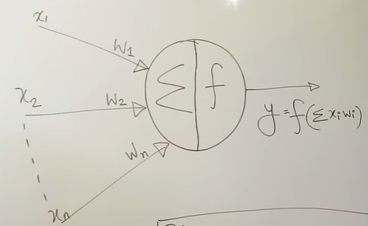

# ANN

Model inspired by the structure and functioning of human brain.  
Consists of - Nodes (neurons) + layers + weights + bias factor   
that work together to recognize patterns, make decisions, and solve complex problems.

  

Takes inputs, applies weights, adds bias, passes result through an activation function to produce output

Input Layer: Takes raw data  
Hidden Layer(s): Performs computations and feature extraction.  
Output Layer: Produces the final result

---