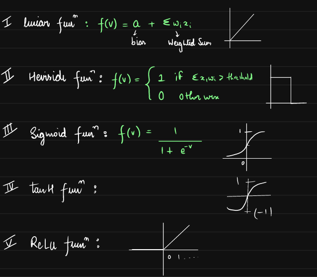
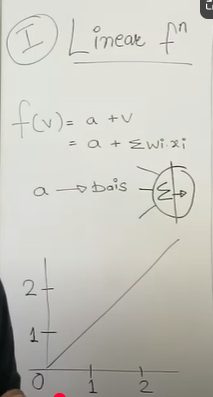
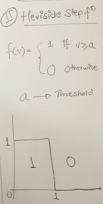
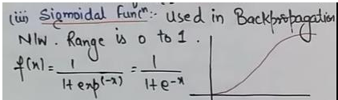
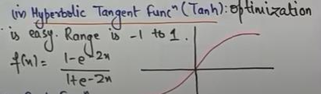
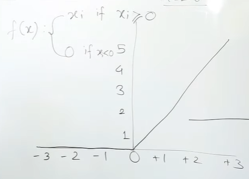

# ACTIVATION FUNCTION

### 1. LINEAR

### 2. HEVISIDE

### 3. SIGMOID | LOGISTIC

Leads to vanishing gradient problem

### 4. tanH | Hyperbolic tangent
Zero centered function  

### 5. ReLU
Rectified Linear Unit
