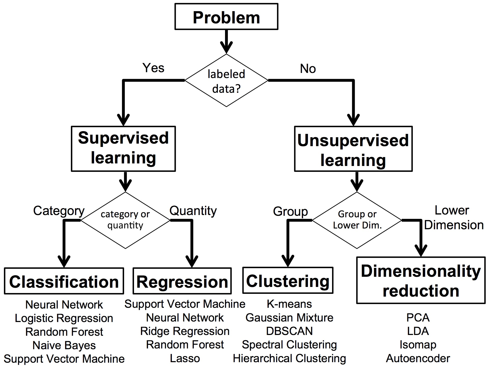
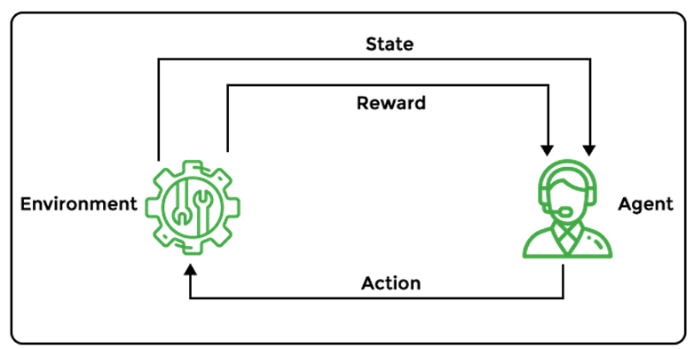

# ML
Subset of AI,  
focuses primarily on the creation of algorithms  
that enable a computer to independently learn from data and previous experiences.

Branch of AI where computers learn from data to make decisions without being explicitly programmed.

TYPES OF ML -

## 1. SUPERVISED
1. Classification 
Output variable is a category 
For e.g. Yes/No, male/female 
2. Regression 
Output is a real value. 
For e.g. Sales/Weather Forecasting,  

ALGORITHMS: 
1. Linear Regression 
2. Logistic Regression 
3. Decision Trees 
4. Random Forests 
5. Support Vector Machines (SVM) 
6. K-Nearest Neighbour (KNN) 
7. Naive Bayes 
8. Artificial Neural Networks (ANN) 

## 2. UNSUPERVISED
1. Clustering 
Like Netflix recommendation 
2. Association 
How one data element is dependent on other. 

ALGORITHMS  
1. K-Means Clustering
2. Principal Component Analysis (PCA) 

## 3. SEMI SUPERVISED
Combination of both

## 4. REINFORCEMENT LEARNING
learns by trial and error. 
