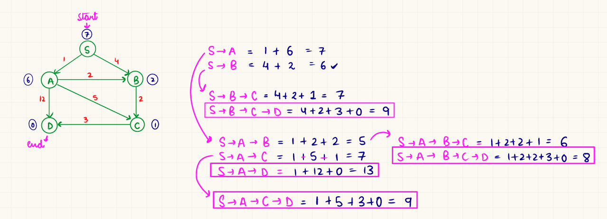

# A* Algorithm
Graph traversal and search algorithm.  
Finds shortest path

Uses heuristic function and cost to reach node 'n' form start node.

    F(n) = g(n) + h(n)

    g(n) : cost from start to current node
    h(n) : cost from current to goal node

ALGORITHM
   
    1. Initialize Open and Closed List
    2. Add Start node to open list
       1. Compute g(n) + h(n)
    3. Repeat until List is empty or goal reached
       1. Select node with lowest F(n)
       2. Move Selected node to closed list
       3. Expand and generate all sucessors
       4. Compute F(n) for each sucessor
       5. If a successor is already in the Open list with a lower g(n) value,  
       discard the new path.
       6. If a successor is in the Closed list and the new path is better,  
       move it back to the Open list.

