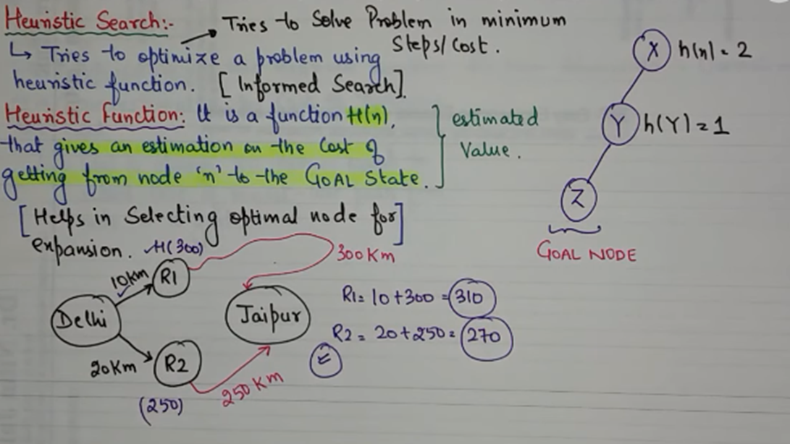
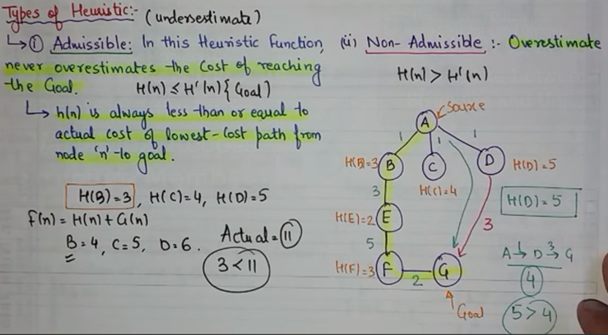

# Heuristic Search
Tries to optimize a problem using heuristic function.  
Tries to solve a problem in minimum steps / cost.  
Type of Informed Search.

## Heuristic Function
H(n) that gives an estimation on cost of getting from node 'n' to the GOAL state.  
Helps in selecting optimal node for expansion.

---

## Types

### 1. Admissible
Under estimates the path cost.  
`h(n) <= h'(n)`

