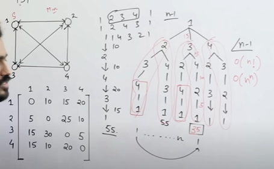

# Monkey and Banana Problem 

A **hungry monkey** is in a room where bananas are **hanging from the ceiling**.  
The monkey **cannot reach the bananas directly**, but there is a **box in the room** that can be used to reach them. The goal is for the monkey to get the bananas.

### State Representation
- **Initial State**: Monkey is on the floor, bananas are hanging, and a box is present.
- **Goal State**: Monkey has the bananas.

#### Possible Actions
1. **Walk** to the box.
2. **Push** the box under the bananas.
3. **Climb** the box.
4. **Grab** the bananas.

#### Solution Using Means-Ends Analysis (MEA)
1. The monkey sees the **difference** (bananas are out of reach).
2. It finds an **action** to reduce this difference (push the box under bananas).
3. It **executes** the action (walks to the box, pushes it, climbs it, and grabs the bananas).
4. **Goal Achieved!** 🍌

---

