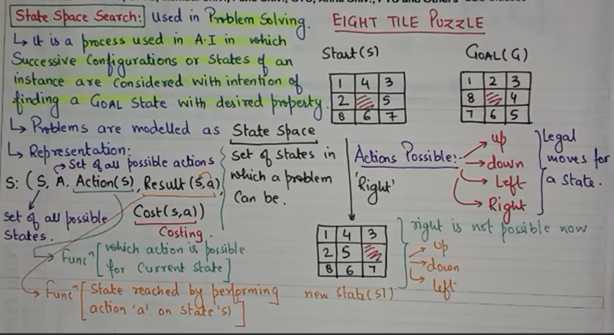

# State Space Search?
Process in which successive states of an instance are considered  
with the intention to find goal state.  

Problems are modelled as **State Space**  
Set of states and connection between them to represent a problem.  
Graph is uses for representation.  

    S : ( S, A, Action(s), Result(s, a), Cost(s, a) )
    
    A => Set of all actions
    S => Set of all states
    s => Single state from S

For eg : 8 Puzzle
